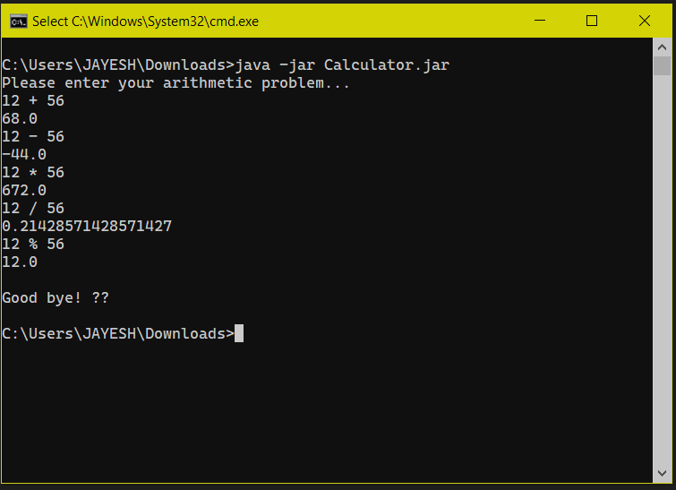

---

<div align="center">
<h1><b>Calculator Application</b></h1>
</div>

<div align="center">


</div>

## **My Application.**

> A very simple _calculator_ application coded in _kotlin_ programming language which takes inputs from user along with some ```arithmetic operator``` and perform further calculations.

> I have also implemented some _**input validations**_ :

*   ``` input != null ```

    > Null safety in conditions


*   ``` input.isNotBlank() ```

    > Returns ```true``` if this char sequence is not empty and contains some characters except of whitespace characters.
    
<br>

## **Kotlin Concepts Used**

1. **main() Function**

> The ```main()``` function is the entry point to a kotlin program.

```kotlin
    fun main(vararg arg: String){
        // calculator logic code
    }
```

2. **Split String**

> ```input.split(' ')``` 
>. Kotlin split string using _delimiters_ as an parameter to split input from user into separate character.

```kotlin
    val values:List<String> = input.split(' ')
```

3. **if-else control flow**

```kotlin
    if (values.size < 3){
        println("Invalid input. Expected: value + value. Received: $input")
    }else {
        // other code
        }
```

> To check if user has giver the right amount of input.

4. **When Expression**

```kotlin
val result = when (operator) {
            "+" -> lhs + rhs
            "-" -> lhs - rhs
             "*" -> lhs * rhs
            "/" -> lhs / rhs
            "%" -> lhs % rhs

            else -> throw IllegalArgumentException("Invalid operator: $operator")
            }
```

> ```when``` operator is same as ```switch case``` in C/C++.

5. **Arrow (->) Operator**

```kotlin
        "+" -> lhs + rhs
        "-" -> lhs - rhs
        "*" -> lhs * rhs
        "/" -> lhs / rhs
        "%" -> lhs % rhs
```

> It will separate the condition and body of a ```when``` expression branch.
> If matches with inputed operator from user then it will perform that operation allocated to that operator like ```"+" -> lhs + rhs```

6. **else-if operator**

```kotlin
    val lhs = values[0].toDoubleOrNull() ?: throw IllegalArgumentException("Invalid input: ${values[0]}")
    val rhs = values[2].toDoubleOrNull() ?: throw IllegalArgumentException("Invalid input: ${values[1]}")
```

> If input doesn't return _Double_ or _Null_ then it runs else part will get execute by throwing an IllegalArgumentException

7. **readline()**

```kotlin
    var input: String? = readLine()
```

> Reads a line of input from the standard input stream. To take the inputs from user

<br>

## **Setup**

*  Download ```.jar``` file from [**_here_**](https://www.dropbox.com/s/2x3uekzihk15eft/Calculator.jar?dl=0) 
*  Open Command Prompt or Terminal.
*  ```cd``` into that downloaded folder.
*  run ```java -jar Calculator.jar```

<br>

## **Preview**



<br>

## **Code Improvements.**

> Code is written in clean manner as much as possible.
> Also outputed answers is improvised using ```.toDoubleOrNull()``` for long range value.

---

## **Certificate** 🏆


> **Download from** [**here.**](https://github.com/TechLead-21/Calculator-Application/raw/master/assets/certificate.pdf)

---

<div align="center">
<h5><b>Thanks for reading out 😊</b></h5>
</div>